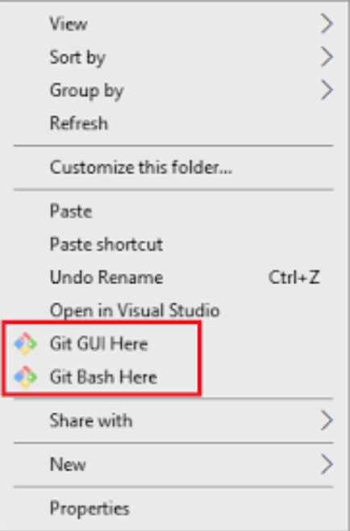

# Karma Sürü Simülasyon Projesi

## Kurulum

1. Python 3 yüklü olduğuna ve PATH değişkenin eklendiğine emin olun

2. git için de aynı şey geçerli ( ͡° ͜ʖ ͡°)

3. Projeyi clonelayıp içine girin

```sh
$ git clone git@github.com:Vorfex42/karmasuru22.git
$ cd karmasuru22
```

4. pip kullanarak gerekli paketleri yükleyin

```sh
$ pip install -r requirements.txt
```

5. Teknofest'in yayınladığı [simülasyonu](https://drive.google.com/drive/folders/1rhwo-mK7Vp1QYcpO3EgLBtEYGMZbLp02?usp=sharing) indirin

6. Kendi platformunuzun zip dosyasını açın ve buraya kopyalayın. Klasörün adını `sim` yapın.

En son dosya yapısının böyle olması lazım

```
karmasuru22/
    sim/
        KARMASIM.exe
        ...
    ...
```

## Çalıştırmak için

`main.py` dosyasını çalıştırmanız yeterli. Oyun kendiliğinden başlayacak.

```sh
$ python main.py
```

## Not

Windows'ta bash komutlarını çalıştırmak için git bash kullanabilirsiniz.

Başlatmak için klasöre sağ tıklayıp `Git Bash Here`'e tıklayın.



---

Klavye ile arabayı kontrol etmek için programa bazı izinleri vermeniz gerekebilir. Olmazsa yönetici olarak çalıştırmayı falan deneyin
